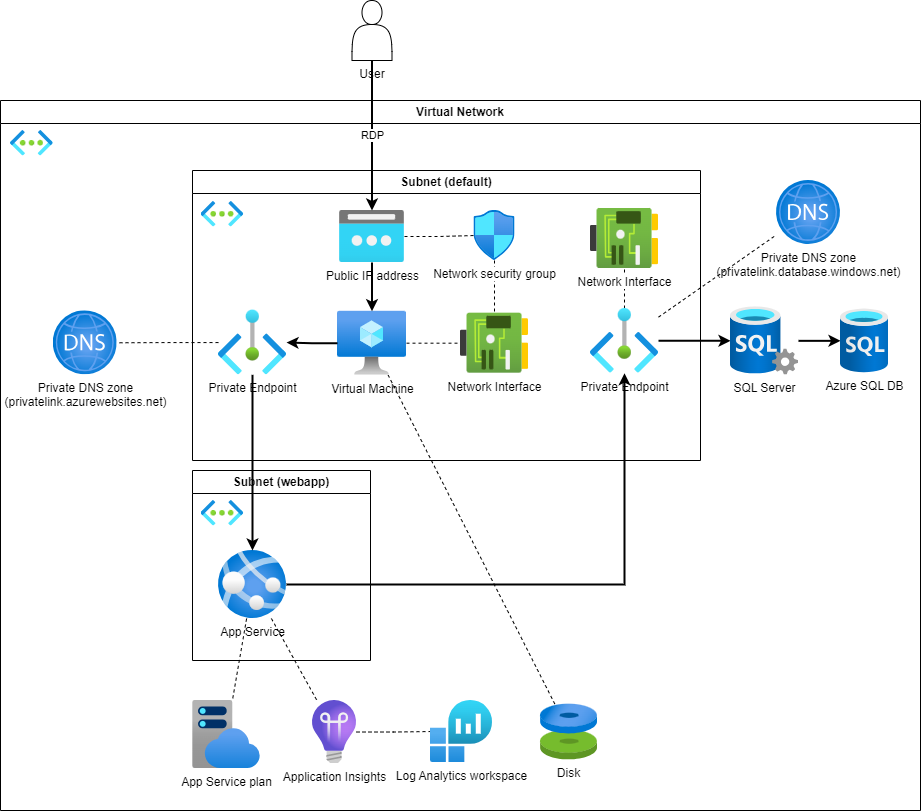

# Goal
To run a blazor app, reading data from a SQL Server DB, using Entra ID authentication.
The complete application should be network integrated and only accessible from within the vnet.

# Setup
## Deploy infrastructure with bicep
- run the deploy_infra.yml as pipeline in Azure DevOps
## SQL DB
- login to the azure virtual machine
- login to azure portal
- move to sql db query editor
- Add example data to db
	````sql
	-- Create the SalesLT schema if it doesn't exist
	IF NOT EXISTS (SELECT * FROM sys.schemas WHERE name = 'SalesLT')
	BEGIN
		EXEC('CREATE SCHEMA SalesLT');
	END

	-- Create the Customer table
	CREATE TABLE SalesLT.Customer (
		CustomerID INT PRIMARY KEY,
		FirstName NVARCHAR(50),
		LastName NVARCHAR(50),
		EmailAddress NVARCHAR(100)
	);

	-- Insert 10 rows of example values
	INSERT INTO SalesLT.Customer (CustomerID, FirstName, LastName, EmailAddress) VALUES
	(1, 'John', 'Doe', 'john.doe@example.com'),
	(2, 'Jane', 'Smith', 'jane.smith@example.com'),
	(3, 'Michael', 'Johnson', 'michael.johnson@example.com'),
	(4, 'Emily', 'Davis', 'emily.davis@example.com'),
	(5, 'David', 'Brown', 'david.brown@example.com'),
	(6, 'Sarah', 'Wilson', 'sarah.wilson@example.com'),
	(7, 'James', 'Taylor', 'james.taylor@example.com'),
	(8, 'Linda', 'Anderson', 'linda.anderson@example.com'),
	(9, 'Robert', 'Thomas', 'robert.thomas@example.com'),
	(10, 'Patricia', 'Jackson', 'patricia.jackson@example.com');
	```
- Add the web apps managed identity to the SQL Server
	```sql
	CREATE USER [blazorapp123] FROM EXTERNAL PROVIDER;
	ALTER ROLE db_datareader ADD MEMBER [blazorapp123];
	```
## Source Code Deployment
As the web app is only accessible from within the vnet, source code can only be deployed from within the vnet.
Therefore a pipeline agent has to be installed on the vm.
- login to the vm
- go to dev.azure.com/<your-organization>/<your-project>/_settings/agentqueues
- add a agent pool
- follow the instructions to add a new agent (installing it on your vm)
- deploy the source code with the [deploy_src.yml](./deployment/deploy_src.yml) pipeline